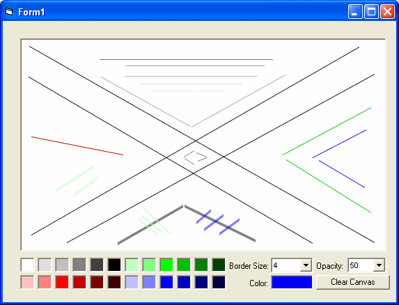



## AntiAliased Line \- Fast &amp; probably the best on PSC

### Description

Draws an AntiAliased line. -it is fast (API). Alows any transparency and any thicknes! -nothin like on the PSC, I'm sure... - there are some examples on how to do it, put they are not as acurate as this one is - especialy by drawing to the exact point and by suporting thicknes and alpha...

Please report bugs...Sugestions, improvements, optimizations (although the code is very fast as it is), etc... And vote if you find it good.

----

Special thanks to Vlad Vissoultchev for the AlphaBlend function 

----

 
### More Info
 

             |
---                |---
**Submitted On**   |2005-08-03 05:50:04
**By**             |[Oricron](https://github.com/Planet-Source-Code/PSCIndex/blob/master/ByAuthor/oricron.md)
**Level**          |Advanced
**User Rating**    |4.6 (55 globes from 12 users)
**Compatibility**  |VB 5\.0, VB 6\.0
**Category**       |[Graphics](https://github.com/Planet-Source-Code/PSCIndex/blob/master/ByCategory/graphics__1-46.md)
**World**          |[Visual Basic](https://github.com/Planet-Source-Code/PSCIndex/blob/master/ByWorld/visual-basic.md)
**Archive File**   |[AntiAliase192051832005\.zip](https://github.com/Planet-Source-Code/oricron-antialiased-line-fast-amp-probably-the-best-on-psc__1-62054/archive/master.zip)

